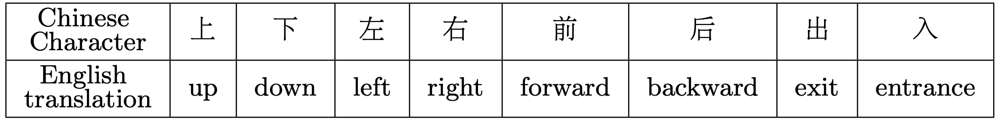
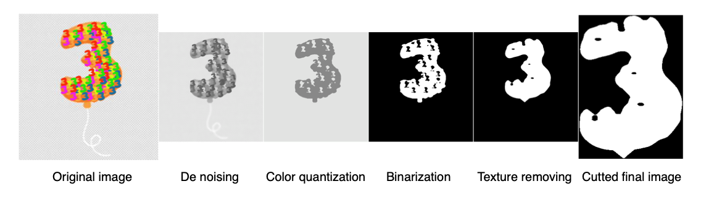
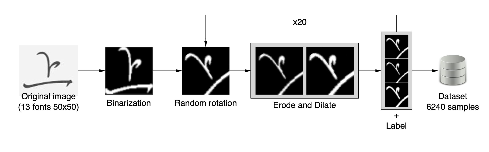
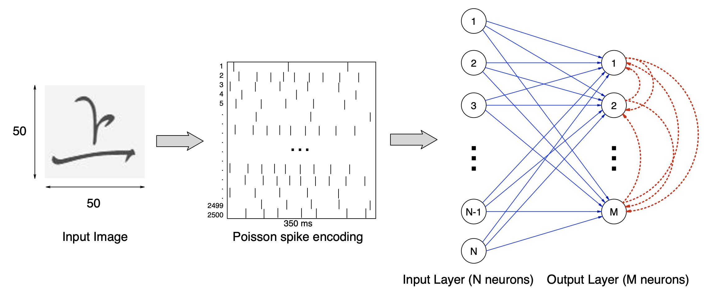
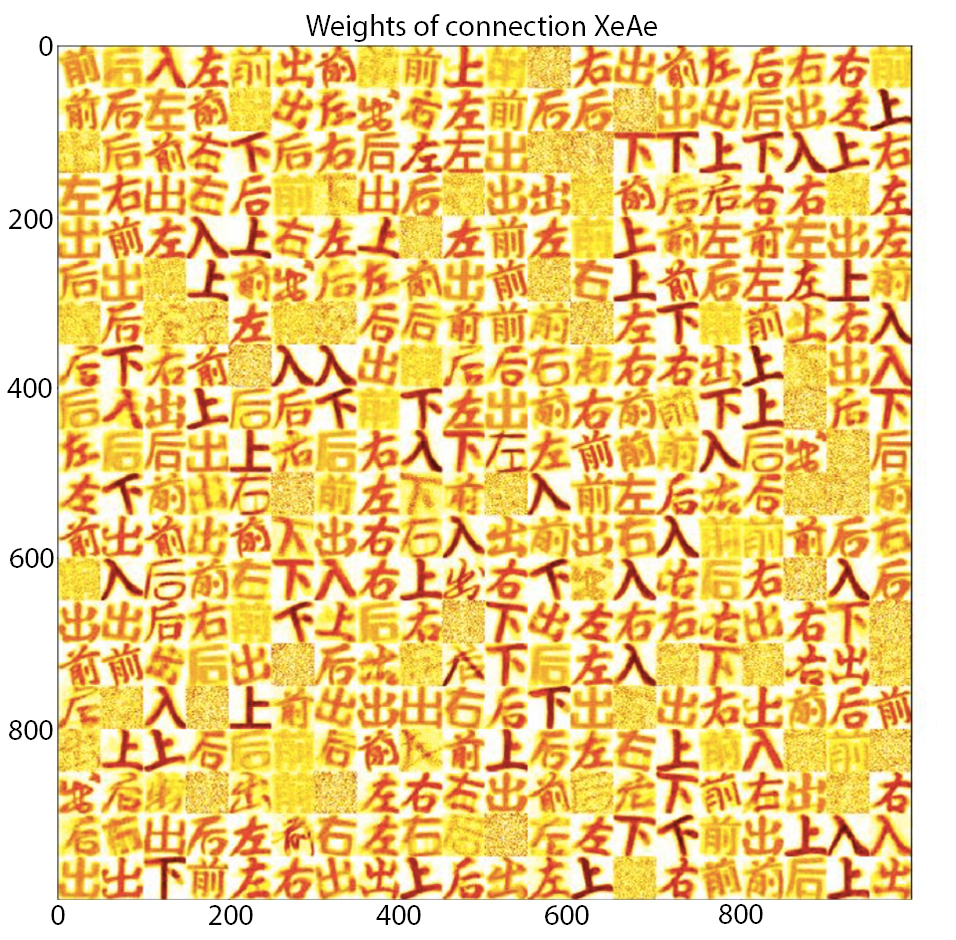

# Pattern Recognition Spiking Neural Network for Classification of Chinese Characters

#### Nicola Russo1, Wan Yuzhong2, Thomas Madsen1 and Konstantin Nikolic1,2

<i>1University of West London - School of Computing and Engineering St Mary’s road, W5 5RF, London, UK</i>
<i>2Imperial College London - Institute of Biomedical Engineering South Kensington Campus London SW7 2AZ, UK</i>

ESANN 2023 proceedings, European Symposium on Artificial Neural Networks, Computational Intelligence and Machine Learning. Bruges (Belgium) and online event, 4-6 October 2023, i6doc.com publ., ISBN 978-2-87587-088-9. Available from http://www.i6doc.com/en/.

### Abstract 
The Spiking Neural Networks (SNNs) are biologically more realistic than other types of Artificial Neural Networks (ANNs), but they have been much less utilised in applications. When comparing the two types of NNs, the SNNs are considered to be of lower latency, more hardware-friendly and energy-efficient, and suitable for running on portable devices with weak computing performance. In this paper we aim to use an SNN for the task of classifying Chinese character images, and test its performance. The network utilises inhibitory synapses for the purpose of using unsupervised learning. The learning algorithm is a derivative of the traditional Spike-timing-dependent Plasticity (STDP) learning rule. The input images are first pre-processed by traditional methods (OpenCV). Different hyperparameters configurations are tested reaching an optimal configuration and a classification accuracy rate of 93%.

### Pre-processing pipeline

### Dataset Creation

### SNN Topology

### Results

